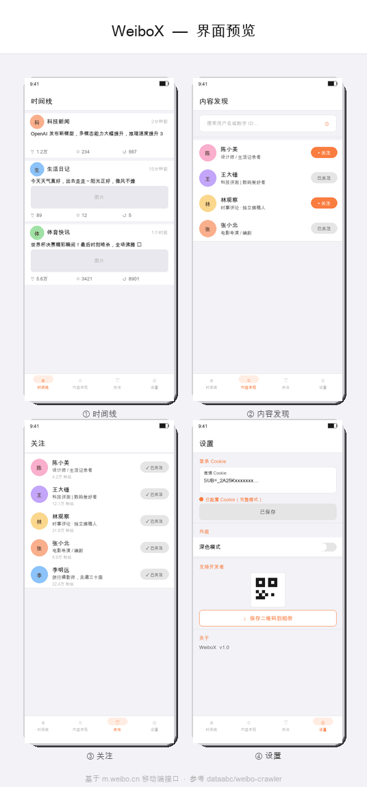

# WeiboX

**无需登录，开箱即用的第三方微博 Android 客户端。**

安装后直接浏览——App 会在后台自动建立匿名访客会话，无需任何账号配置即可搜索用户、查看主页和微博。如需时间线聚合或完整评论功能，在设置中粘贴微博 Cookie 即可升级到完整模式。

## 运行模式

|  | 访客模式（无需登录） | 完整模式（配置 Cookie） |
|---|---|---|
| 搜索用户（关键词） | ✅ | ✅ |
| 搜索用户（数字 UID） | ✅ | ✅ |
| 用户主页 / 微博列表 | ✅ | ✅ |
| 时间线（关注用户聚合） | ✅ | ✅ |
| 评论 | ✅ 基础首页 | ✅ 热门评论 + 无限分页 |
| 某用户的关注列表 | ❌ | ✅ |
| WebDAV 备份 / 恢复 | — | ✅ |

> **访客模式原理**：冷启动时后台用 WebView 访问 `m.weibo.cn`，自动完成微博访客 session 初始化（`genvisitor2` → incarnate），获取 `SUB` / `XSRF-TOKEN` 等必要 Cookie，整个过程用户无感知，通常在几秒内完成。

## 功能

- **匿名浏览**：无需微博账号，安装即用，自动建立访客会话
- **时间线**：聚合所有本地关注用户的最新微博，顶栏显示刷新状态，支持手动点击刷新
- **内容发现**：关键词或数字 UID 搜索用户（访客模式走 `s.weibo.com` HTML 解析，无需 API 权限）
- **关注管理**：本地独立维护关注列表（与微博账号无关），随时关注 / 取关
- **用户主页**：头图、头像、简介、统计数据、微博列表、关注列表
- **评论**：基础评论随时可看；配置 Cookie 后解锁热门评论排序和无限分页
- **验证码处理**：触发微博验证码时自动弹出内置浏览器，手动完成后无缝继续
- **防限流**：参考 weibo-crawler，请求间隔 3~6 秒随机，活跃用户优先刷新
- **WebDAV 备份 / 恢复**：关注列表和 Cookie 备份到私有 WebDAV 服务器
- **深色模式**：跟随系统或在设置中手动切换

## 技术栈

| 层 | 技术 |
|---|---|
| UI | Jetpack Compose + Material3 |
| 架构 | MVVM + Hilt 依赖注入 |
| 网络 | OkHttp（直连 `m.weibo.cn` / `s.weibo.com`） |
| 访客 Session | WebView + `android.webkit.CookieManager` 自动初始化 |
| HTML 解析 | Jsoup（`s.weibo.com` 用户搜索，无需登录） |
| 本地缓存 | Room（帖子 500 条上限 / 7 天自动清理） |
| 持久化 | DataStore Preferences |
| 图片 | Coil |

## 界面预览



## 致谢

本项目的网络请求逻辑、接口地址、请求头策略及限流方案，均参考自开源项目：

**[dataabc/weibo-crawler](https://github.com/dataabc/weibo-crawler)**

WeiboX 可以理解为将 weibo-crawler 的 Python 数据获取层用 Kotlin 为 Android 平台重新实现的版本。感谢原项目作者的持续维护。

---

## 项目结构

```
weiboX/
├── app/src/main/
│   ├── AndroidManifest.xml
│   └── java/com/weibox/app/
│       ├── MainActivity.kt              # 入口；冷启动时后台初始化访客 session
│       ├── WeiboXApp.kt                 # Application，Hilt 初始化
│       │
│       ├── data/
│       │   ├── api/
│       │   │   └── WeiboApi.kt          # ★ 核心：m.weibo.cn 接口 + s.weibo.com 搜索
│       │   ├── db/
│       │   │   ├── AppDatabase.kt
│       │   │   ├── dao/
│       │   │   │   ├── PostDao.kt
│       │   │   │   └── UserDao.kt
│       │   │   └── entity/
│       │   │       ├── PostEntity.kt
│       │   │       └── UserEntity.kt
│       │   ├── model/
│       │   │   ├── WeiboComment.kt
│       │   │   ├── WeiboPost.kt
│       │   │   └── WeiboUser.kt
│       │   ├── prefs/
│       │   │   └── AppPreferences.kt    # Cookie / WebDAV / 深色模式持久化
│       │   ├── repository/
│       │   │   └── WeiboRepository.kt   # 数据层统一入口；自动选择登录 / 访客 Cookie
│       │   ├── session/
│       │   │   ├── VisitorSession.kt    # 访客 Cookie 内存状态（冷启动刷新）
│       │   │   └── CaptchaManager.kt   # 验证码挂起 / 唤醒协调器
│       │   └── webdav/
│       │       └── WebDavService.kt     # WebDAV 备份 / 恢复
│       │
│       ├── di/
│       │   └── AppModule.kt             # Hilt 模块
│       │
│       ├── navigation/
│       │   └── NavGraph.kt              # 底部导航 + 路由 + 验证码弹窗监听
│       │
│       └── ui/
│           ├── components/
│           │   ├── CaptchaDialog.kt     # 内置 WebView 验证码对话框
│           │   ├── CommentsBottomSheet.kt
│           │   ├── ImageViewer.kt
│           │   ├── PostCard.kt
│           │   ├── UserCard.kt
│           │   └── WeiboTopBar.kt       # 统一顶部导航栏（含居中 Logo）
│           ├── screen/
│           │   ├── following/           # 关注 Tab
│           │   ├── followinglist/       # 某用户的关注列表
│           │   ├── home/                # 时间线 Tab（顶栏刷新状态指示）
│           │   ├── profile/             # 用户主页
│           │   ├── search/              # 搜索 Tab
│           │   └── settings/            # 设置 Tab
│           └── theme/
│               ├── Color.kt
│               ├── Theme.kt
│               └── Type.kt
```

---

## 接口对照表（WeiboApi.kt ↔ weibo-crawler/weibo.py）

当 weibo-crawler 更新时，优先检查下表中对应的行号范围。

| WeiboApi.kt 方法 | 功能 | weibo.py 对应位置 |
|---|---|---|
| `getUserInfo()` | 获取用户信息 | `get_user_info()` **L781**，containerid `100505{uid}` **L783** |
| `getUserPosts()` | 获取用户微博列表 | `get_weibo_json()` **L606**，containerid `230413{uid}` **L616** |
| `getFollowingList()` | 获取用户的关注列表 | 无独立函数，containerid `231051_-_followers_-_{uid}` |
| `getComments()`（有 Cookie） | 热门评论分页 | `_get_weibo_comments_cookie()` **L1712**，URL `hotflow?max_id_type=0` **L1729** |
| `getComments()`（无 Cookie） | 评论基础接口 | `_get_weibo_comments_nocookie()` **L1778**，URL `comments/show` **L1791** |
| `searchUsers()`（有 Cookie） | 关键词搜索，走 API | `get_weibo_json()` **L606**，containerid `100103type=3&q=` **L612** |
| `searchUsersByWeb()`（无 Cookie） | 关键词搜索，解析 `s.weibo.com/user` HTML | 无对应（WeiboX 独有） |
| `getVisitorTokens()` | 访客 session 初始化 token | 无对应（WeiboX 独有，配合 WebView 实现） |
| `parsePost()` | 解析单条微博字段 | `parse_weibo()` **L1536**，`attitudes_count` **L1568** / `comments_count` **L1571** / `reposts_count` **L1574** |
| `parsePics()` | 解析图片列表 | `get_pics()` **L922**，`pic['large']['url']` **L933** |
| `stripHtml()` | 去除正文 HTML 标签 | `remove_html_tag` **L57** |
| Cookie / XSRF 初始化 | 解析并注入鉴权信息 | Cookie 清洗 **L150**，XSRF-TOKEN 提取 **L162** |
| 请求头（UA / Referer / MWeibo-Pwa） | 模拟移动端浏览器 | User-Agent 随机 **L360**，Referer **L174** |

---

## 根据 weibo-crawler 更新的维护方法

### 何时需要同步

微博偶尔会调整接口路径、返回字段或鉴权机制。weibo-crawler 作为活跃维护的项目，通常会率先修复。遇到以下情况时参照本流程同步：

- WeiboX 请求返回 `ok=-100` 或频繁触发验证码
- 某功能数据为空而 weibo-crawler 正常
- weibo-crawler 发布了涉及接口调用的 commit

### 同步流程

**第一步：定位 weibo-crawler 的改动**

```bash
cd weibo-crawler
git log --oneline -20
git diff HEAD~1 HEAD weibo.py
```

**第二步：根据对照表找到 WeiboApi.kt 的对应位置**

确认改动影响哪个方法，直接跳转到 `WeiboApi.kt` 中对应的函数。

**第三步：逐项移植**

| 改动类型 | weibo.py 常见位置 | WeiboApi.kt 处理位置 |
|---|---|---|
| 接口 URL / containerid 变更 | `get_weibo_json()` / `get_user_info()` | 对应 `suspend fun` 中的 `url` 字符串 |
| 请求头字段增删 | `__init__` headers | `OkHttpClient` 拦截器中的 `.header(...)` |
| Cookie / XSRF 鉴权逻辑 | L150–L165 | `cookieJar` 初始化 + `getXsrfToken()` |
| 返回 JSON 字段改名 | `parse_weibo()` L1536 | `parsePost()` 中的 `optString / optInt` |
| 图片字段结构变更 | `get_pics()` L922 | `parsePics()` |
| 评论接口参数变更 | `_get_weibo_comments_cookie()` L1712 | `getComments()` 中的 URL 拼接 |

**第四步：验证**

1. 构建并安装到真机
2. **访客模式**：冷启动 → 搜索用户 → 进入主页 → 查看微博 / 评论
3. **完整模式**：配置 Cookie → 时间线自动刷新 → 热门评论可分页
